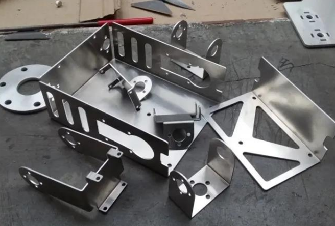
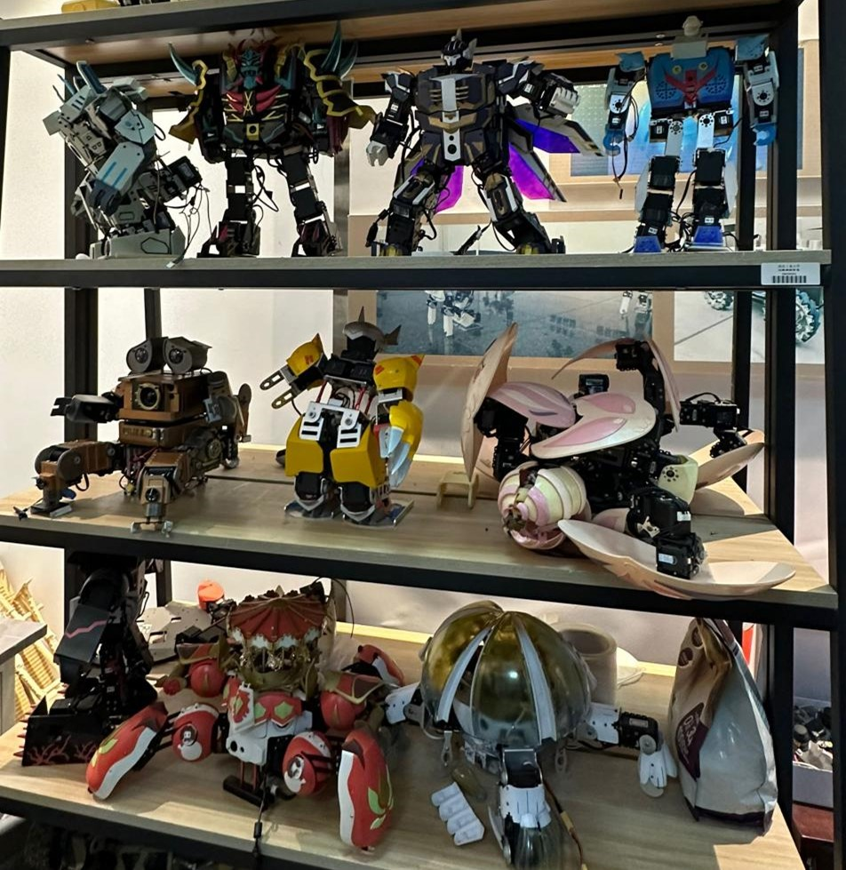

# 机械组介绍

吾日三省吾身

——今天的方案进度肝完了吗？

——今天要装的东西装完了吗？

——今天要找的东西找到了吗？

~~——今天要背的锅背完了吗？~~

## 
 机械组的 ~~搞机~~ 日常

机械组，顾名思义，就是负责机器人的设计、装配和维护工作的项目组。基地参加的基本都是需要实物的项目，这个实物最初的形状就由机械组来敲定 (之后可能被整个魔改) 。怎么实现功能，用什么机构， 如何保证稳定性，怎样方便装配 ，是否有更低成本的解决方案，这些都是机械在设计时需要考虑的问题。在敲定设计方案之后，联系淘宝店家和工厂，将机器人组装起来，并对机器进行维护等，这些都是机械组的工作。

图 1  你们以后会很熟悉的钣金身

图 2  舞蹈机器人的造型也都由机械组的学长设计

图 3   救援组的大救援车

## 
 Q&A部分
### 1. Q：想要进入机械组， 我需要学些什么？
A：方案设计基本是使用 SOLIDWORKS 这款软件，可以先上b站大学自学一波基本操作；留意一下身边一些常见机械的结构；没事干可以翻一下淘宝，比如搜索“轴承”等，有不知道怎么用的可以直接问客服 (都上大学了脸皮也该厚点了) 。机械设 计里经验很重要，需要多了解、多积淀。招新开始之后，我们是会安排培训的，不用担心（跟着学绝对没问题）。 
### 2. Q：机械组的招新考核流程是怎么样的呢？
A：培训，机试，面试，一轮方案绘制，二轮方案绘制。我们会进行一段时间的培训。培训的内容是 SOLIDWORKS 这款软件的基本操作（时间在大一上）。培训结束后会有机试（一般在大一下开学），检验各位的绘图水平。只要认真练习，机试是不难通过的。
面试不用紧张，只是见个面，聊下天，了解一下你的基本情况，比如什么专业，学过什么，有什么特长，可能会问一些有关机械的小问题(这真的不是考题，不用担心，担心也没用，这就看各位组长的心情了)。
接下来就到了方案考核的环节，方案考核是整个招新考核的重头戏。一般来说，会有两轮方案考核。在第一次考核结束之后，会将每个人按照意愿细分到项目组，跟着对应的学姐学长(没错，机械组学姐最多，这是真的) 做方案设计，经过第两轮或第三轮筛选之后敲定最终名单。机械考核时间跨度比较大，但只要坚持下来，一定能成为大佬！
### 3. Q：进入机械组有没有什么福利？
A：欢迎加入大型接锅背锅兼快速脱发组织。和一堆大佬在一起工作， 有一天你会发现你已经超过了许多同学，有付出就会有所收获。而且在机械方面， 经验是非常重要的。同时，基地会提供一个自由发挥和实践的平台，让你有机会去验证和应用课本所学的知识。 机械组氛围轻松，在这里你能收获快乐与友情。
### 4. Q：基地会不会占用我很多时间？会不会影响学习？
A：不少，不会。别把所有事情拖到 deadline 前一晚上再开始干，记得合理安排时间，也就每周少打一会游戏的样子。
### 5. Q：机械组需要什么样的人？
A：能劳逸结合的，敢于为结果背锅，不甩锅， 、肯承担责任的。这不是一句空话，因为设计是你的设计，你出了问题，肯定是你去想办法解决。
### 6. Q：基地现在使用什么版本的 SOLIDWORKS ？
A：SOLIDWORKS 2022sp5.0。觉得下载麻烦的可以上某宝找人代下。
### 7. Q：培训难不难，进组难不难？
A：培训并不难，只要认真听讲，认真完成学长学姐布置的作业，机试都是没有问题的。只要你有认真的态度，并付出不懈的努力，不要半途而废，坚持下去，进组也指日可待。
（大部分人都是在考核过程中中途放弃的，轻舟已过万重山）

招新只招24届哦~
如果各位学弟学妹还想进一步了解有关机械组的细节，欢迎随时在群里向学长学姐们提问(\*\^_\^\*)。

