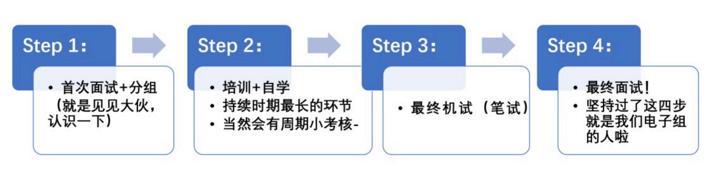

# 关于电子组

电子组？电控组？硬件组？

没错，这些都是我们！称呼随便啦~~

首先，是大伙最关心的咱们电子组的招新流程------

一图以蔽之

!!! Note "最终”成绩“主要参考三个方面"

    -   Step 2 考核期间任务完成情况
    -   Step 3 机试成绩
    -   Step 4 面试成绩

怎么样，只要坚持完成这几步就可以进入舞基的大家庭了，是不是很简单(｡･ω･｡)ﾉ ♡

啥？你说你对这些内容具体还是不够了解，那就接着看下去吧

## About 电子组

### Q1 电子组是干什么滴？

​ 简单来说，我们是**“掌控”机器人的身体** 的：

1. **电路的设计：**模拟电路的设计以及能够实现一定逻辑功能的数字电路的设计
2. **PCB（电路板）的绘制与焊接：**利用相关软件（Altium Designer、立创 EDA），在上述电路设计的基础上，绘制出原理图，并进一步将其设计和绘制为 PCB(电路板)；在这之后，完成 PCB 元器件的焊接。
3. **相关控制代码编写：**在得到一个自己设计并焊接的主控板后，我们可以通过单片机编程所学，来进行相关 机器人基本控制和拓展内容代码的编写，并通过主控板完成代码的烧录
4. **机器人调试与功能创新：**正如前言，控制和调试机器人同样是属于我们电子组的环节；同时，我们也可以对机器人的“身体”功能进行相应的创新

!!! Question "你可能会觉得：“这些东西看起来好难啊，我都不认识，如果参加的话会不会只是陪跑呢？"

    其实不用担心，大多数学长学姐们刚开始也是啥也看不懂（悲），大家一开始基本都是 0 基础的；同时，在了解和学习相关知识期间，同样是对自己能力的提高和拓展的一个过程。

    所以，放心接着往下看吧！

### Q2 想要加入咱们电子组，我需要做哪些准备/学习哪些知识？

1. **PCB 的设计和绘制流程：**在正式敲开 “电子” 的大门前，大伙可以先去了解和学习 PCB（印制电路板）的设计和绘制（通过软件如 Altium Designer、立创 EDA 等），这也是我们去更好地理解电路设计的第一步。
2. **51 单片机的原理和应用：**在我们的 Step 2—也就是培训和考核阶段主要考察 51 单片机的原理应用，掌握基本原理并融会贯通，实现自己的例程和创新 （等你烧录了第一个流水灯程序时，你就成 功入了电子的坑/好耶！

!!! Tip "推荐两个 B 站电路知识科普 UP 主，讲的很棒，不涉及专业知识，可作为电子电路入门视频"

    -   工科男孙老师
    -   爱上半导体

### Q3 PCB 和单片机是什么东西？（接上一条---）

> 哈，在写这个文档前其实我也想问

-   **PCB：**印制线路板，即我们常说的没有元器件的电路板，在绝缘基材上实现元器件之间电气连接（的印制电路；PCB 可以有很多层—像一个多层蛋糕，每层都可以进行不同的设计走线。
-   **单片机：**高情商的来说，它是一个可实现自主编程的微小计算机系统；简单来说，它就是一个听”代码“话的电子器件，我们编写的代码让它干什么它就干什么；它是一个连接软（电脑代码）硬（实现相关功能—当然这个它自身也是硬件）的桥梁；或许大伙认为对它接触甚少，但其实在我们生活中处处可见它的身影——电视、空调、洗衣机、遥控器、感应门.......

### Q4 怎么入门学习 PCB 与单片机？（再接上上条---）

1.  **PCB：**了解 PCB 的绘制流程和基本电路原理，分清原理图、PCB、原理图库与封装库各是什么；在此基础上，绘制自己的第一块 PCB 板（可以是一个电路模块、一个最小系统板，甚至是一块不走线只有丝印的装饰板）,然后就可以将绘制完并将其打印出来了（嘉立创下单），这样就拥有了自己的第一块板子啦。

    ??? Tip "推荐学习视频"

        -   [x] [Altium Designer 20 19（入门到精通全 38 集）四层板智能车 PCB 设计视频教程 AD19 AD20 凡亿](https://www.bilibili.com/video/BV16t411N7RD/?share_source=copy_web&vd_source=9a9beb1dd6fb98e99e7195d46b2415ba)
        -   [x] [Altium Designer 1 小时（貌似不够）速成（可能不止一小时*~* 但我觉得仨小时肯定够了---来自 up 猪的自信!!）](https://www.bilibili.com/video/BV17E411x7dR/?spm_id_from=333.337.search-card.all.click)
        > Altium Designer 建议安装 19、20 版本，不要安装 21 及以上版本，不然汉化不完全看起来会很痛苦

2.  **单片机：** 入手一个 51 单片机开发板，跟着学习资料（视频或书）去实践学习；在寒假这么长的时间段中，建议在学会相关例程的基础上尝试自己去练习、去利用所学写一些相关的程序，毕竟学以致用才是最重要的嘛~~学到不懂不会的地方，就狠狠的百度或上 CSDN 查，尽量避免似懂非懂的地方存在；当然，学有余力的同学 / 觉得 51 太简单的同学 / 有一定基础的同学在 在学完 51 并确保自己融会贯通的前提下，可以去尝试学习 Stm32 单片机（初学者建议先学习 Stm32 的 HAL 库）。

    > 要把握好自己的理解程度，不要好高骛远哦，毕竟考核还是面向 51 的

    ??? Tip "推荐单片机"

        - [x] 清翔 51 单片机（在淘宝直接搜索，建议买绿色盒子款式的，标准配置即可）
        > 千万不要买普中单片机！千万不要买普中单片机！千万不要买普中单片机！（重要的事情说三遍）

    ??? Tip "推荐学习视频"

        -   [x] [最新/最全清翔零基础 51 单片机教程+数据手册指导+提升(清翔官方教程，代码可直接使用)](https://www.bilibili.com/video/BV1nt411f7To/?share_source=copy_web&vd_source=9a9beb1dd6fb98e99e7195d46b2415ba)
        -   [x] [51 单片机入门教程-2020 版 程序全程纯手打 从零开始入门(B 站 51 单片机播放量最高视频，讲解深入浅出，但引脚与清翔 51 单片机不对应，可结合上一教程观看)](https://www.bilibili.com/video/BV1Mb411e7re/?spm_id_from=333.337.search-card.all.click&vd_source=62a7635d921cce67dea81ae86f2b7864)
        -   [x] [[野火]STM32 HAL 库开发实战指南 教学视频 手把手教学 STM32 全系列 零基础入门 CubeMX+HAL 库，基于野火全系列 STM32 开发板(适合深层次学习 HAL 库)](https://www.bilibili.com/video/BV18X4y1M763/?spm_id_from=333.337.search-card.all.click&vd_source=e5c084a1e9cffafd29af06940999463d)
        -   [x] [[STM32]HAL 库 STM32CubeMX 系列学习教程（可作为 HAL 库基础入门）](https://blog.csdn.net/as480133937/article/details/99935090?spm=1001.2014.3001.5506)

    ??? Tip "推荐参考书籍"

        -   [x] 郭天祥《十天学会 51 单片机》
        -   [x] 漆强《嵌入式系统设计—基于 STM32CubeMX 与 HAL 库》（HAL 库教程）

### Q5 学会电子相关技能，我可以做些什么？

-   自己**DIY**一些有关电子的**小项目**：例如：指纹/声音锁、电子产品遥控器、游戏手柄、墨水屏小电视等等。
-   掌握足够的能力后，做一些基地外的**“大项目”**：例如：遥感机械臂、互动机器人、智能车、空中/水下航行器等等。

!!! Tip ""

    这些不同项目的本质和基础知识正是电控方面所学，只有你想不到，没有做不到！

    感兴趣的同学强烈推荐去关注 b 站 up 主—稚辉君

### Q6 电子组必须掌握的前置技能

最重要的是**C 语言（C++也可以，但考核主要看 C）**。还有对单片机的实际应用、对电路的理解。

-   **C 语言：**初期掌握 C 语言基础知识就好（数组起步，链表截止），不同于 ACM 的编程，单片机编程 的逻辑简单很多，入门后进步很快。但是 C 语言的知识还是要认真回顾，不然容易出一些低级的 BUG。
-   **电路：**零基础也是可以上手学的，电路初期都是很简单的逻辑电平电路，不用担心电学知识（高中物理所学其实能够应付啦，电子组每一级都有好几个学长学姐都是非电类专业）。不会的东西多百度就好，知识就是逐渐积累的过 程。

!!! Warning "上半学期不学 C 的学院的同学一定要自己补！！！！否则会输在起跑线上嗷！"

### Q7 加入基地会不会占用大多时间/影响学习呢？

-   只要时间安排合理,一般不会影响。而且在基地的同学们一般成绩都不会差，因为加入基地后大学生活会更加充实，和基地的大佬交流无形之中就提高了自己的标准。

-   不可否认加入基地还是还是需要时间的投入的，但是没有有效的投资哪里有收获呢？而且可以肯定的是，收获一定是大于投入的。

> 借用学长的一句话：“你猜基地这些人里面有几个第一？”

## 招新流程

**下面就来细说一下找新的每一步流程**（比图片详细一丢丢）

### Step 1 一面

​ 在培训之前，我们会先跟大家进行**第一次面试**，当然这个过程主要是为了**了解大家**，在此之后将会对大家进行分组，以小组为单位进行后续的培训和考核。

### Step 2 考核+培训+自学

​ 考核和培训我们初步计划大分为**两个阶段**

#### 第一阶段：报名截止（约为 11 月底）— 寒假前

​（我们只收 2024 届的小东西哈）

​ 简单了解并学习**Altium Designer**（**简称 AD**），这是大家了解何为 ”电子“ 的第一步。

​ 相关学习资料可以在群里咨询学长学姐。在这一过程中我们会为大家布置一些简单的小任务，来加深印象。（学会就可以自己随心所欲地去绘制自己的”板子“啦）

#### 第二阶段：分两步走

​**1 — 寒假期间：**

​ 在完成 AD 的初步学习之后，我们会给大家充足的时间进行**51 单片机的学习**（时间大致整个寒假,学到清翔官方教程的 IIC 总线 EEPROM 即可），**期间不统一安排任务和考核**，同时在寒假结束之前，我们会要求大家提交寒假**学习报告**。

​**2 — 开学至机试前：**

​ 开学之后，我们会对大家进行 51 以及电子方面相关内容的培训，初步计划会在每周组织一次培训（**大型面基现场**）

​**同时这也是周期任务/考核的开始**，每周培训之后都会发布下一周的相关任务。培训和做任务的过程中如果遇到困难或者疑惑的地方，学长学姐随时欢迎大家的提问（遇到问题都是很正常的，自己先探索一下，如果还是没有解决再问学长哈，理解万岁！）

### Step 3 + 4 机试 and 二面

​ 走到这，大家距离加入基地就差**最后临门一脚啦**，学长学姐初步计划在完成 6~8 周左右的 51 培训之后，在清明至五一左右进行机试，考核范围主要就是大家 51 学习的内容。

​ 机试完成后，我们会结合考核培训期间的表现和最后的机试情况选取入围面试的学弟学妹。

​ 最后，通过面试就成功加入舞基啦！！！

## 写在最后

​ 说了这么多，其实最重要的无非两个词—**坚持，认真**。

​ 整体来讲，考核的周期还是相对较长的，在这一过程中，大家难免会经历不少的困难和挫折，不过不要因此而轻言放弃，相信自己，只要坚持到最后，无论结果如何，你都会收获一个焕然一新的自己！

​**大家加油，舞蹈机器人基地期待你的加入！**
